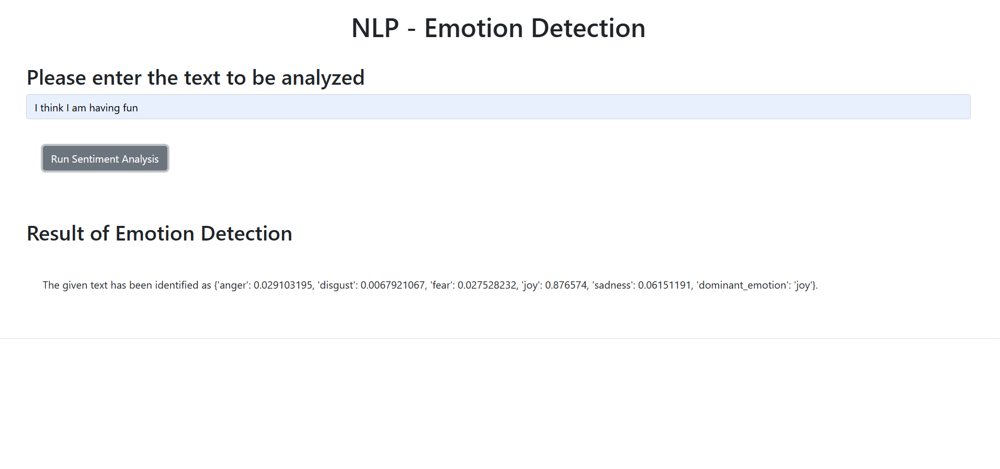

# AI-Based Emotion Detection Application

Course: [Developing AI Applications with Python and Flask](https://www.coursera.org/learn/python-project-for-ai-application-development?specialization=ibm-full-stack-cloud-developer) - [IBM Full Stack Software Developer](https://www.coursera.org/professional-certificates/ibm-full-stack-cloud-developer)

## Table of contents

- [Overview](#overview)
- [Screenshots](#screenshots)
- [Project Features](#project-features)
- [Getting Started](#getting-started)


## Overview
This project demonstrates the development and deployment of an AI-based web application that performs emotion detection on customer feedback. Using IBM Watson Natural Language Processing (NLP) embedded libraries, this application can decipher emotions like joy, sadness, anger, and more, based on text input. The application is deployed as a web service using the Flask framework.

## Screenshots


## Project Features
The application includes the following main features:
    - **Emotion Detection:** Processes customer feedback to detect and display associated emotions such as joy, sadness, anger, etc., using Watson NLP.
    - **Error Handling:** Provides appropriate error responses for invalid inputs or server issues.
    - **Deployment:** Deployed as a web application via Flask, allowing users to access it through a web interface.
    - **Static Code Analysis:** Ensures code adheres to PEP8 guidelines through static code checks.
    - **Unit Testing:** Comprehensive tests validate application outputs for a variety of inputs.

## Getting Started
Prerequisites
  To run this project locally, ensure you have the following installed:
    - Python 3.11
    - Flask
    - Watson NLP Library

Installation
  - Clone this repository to your local machine. (The project skeleton can be accessed by cloning this [repository](https://github.com/ibm-developer-skills-network/oaqjp-final-project-emb-ai.git))
  - Navigate to the project directory.
  - Install required packages
  - Start the Flask application:
    ``` bash
    python3.11 server.py
    ```
